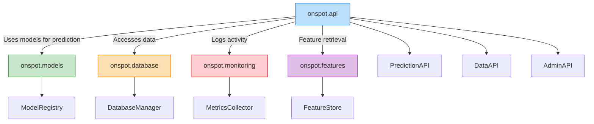

# REST API

The `onspot.api` module provides a RESTful API for accessing parking predictions and related data from the OnSpot Predictive Model.

## API Architecture

The REST API provides a well-structured interface for client applications to interact with the OnSpot prediction system. It integrates with other modules to serve predictions, historical data, and analytics.

```mermaid
graph TD
    subgraph "Client Applications"
        A1[Mobile App]
        A2[Web Dashboard]
        A3[Third-party Services]
    end
    
    subgraph "API Layer"
        B[API Gateway]
        B --> B1[Authentication]
        B --> B2[Rate Limiting]
        B --> B3[Request Validation]
        
        B --> C[API Routes]
        C --> C1[Prediction Endpoints]
        C --> C2[Data Endpoints]
        C --> C3[Analytics Endpoints]
        C --> C4[Admin Endpoints]
    end
    
    subgraph "Service Layer"
        D1[Prediction Service]
        D2[Data Service]
        D3[Analytics Service]
        D4[Admin Service]
        
        C1 --> D1
        C2 --> D2
        C3 --> D3
        C4 --> D4
    end
    
    subgraph "Core Components"
        E1[Model Registry]
        E2[Database]
        E3[Feature Store]
        
        D1 --> E1
        D1 --> E3
        D2 --> E2
        D3 --> E2
        D4 --> E1
        D4 --> E2
    end
    
    A1 --> B
    A2 --> B
    A3 --> B
    
    style "API Layer" fill:#bbdefb,stroke:#1976d2
    style "Service Layer" fill:#c8e6c9,stroke:#388e3c
    style "Core Components" fill:#ffe0b2,stroke:#f57c00
    style "Client Applications" fill:#e1bee7,stroke:#8e24aa
```

### API Module Integration

The API module integrates with several other components in the system:



## Core API Client

### `APIClient`

```python
class APIClient:
    """
    Client for interacting with the OnSpot Predictive Model API.
    
    This class provides methods for making requests to the API
    endpoints and handling responses.
    
    Attributes:
        base_url: Base URL for the API.
        api_key: API key for authentication.
    """
    
    def __init__(
        self,
        base_url: str = "http://localhost:5000/api/v1",
        api_key: str = None
    ):
        """
        Initialize the API client.
        
        Args:
            base_url: Base URL for the API.
            api_key: API key for authentication.
            
        Example:
            >>> # Create an API client
            >>> client = APIClient(
            ...     base_url="https://api.onspot-prediction.com/api/v1",
            ...     api_key="your-api-key-here"
            ... )
        """
```

#### Methods

##### `get_prediction`

```python
def get_prediction(
    self,
    location_id: str,
    timestamp: str = None,
    model_id: str = None
) -> Dict:
    """
    Get a parking occupancy prediction for a specific location and time.
    
    Args:
        location_id: ID of the location.
        timestamp: Timestamp for prediction. If None, uses current time.
        model_id: ID of the model to use. If None, uses default model.
        
    Returns:
        Dictionary containing the prediction result.
        
    Example:
        >>> # Get prediction for location P-123 at current time
        >>> prediction = client.get_prediction("P-123")
        >>> print(f"Predicted occupancy: {prediction['occupancy']:.2f}")
        >>> 
        >>> # Get prediction for a specific time
        >>> prediction = client.get_prediction(
        ...     location_id="P-123",
        ...     timestamp="2023-06-15T14:30:00Z"
        ... )
        >>> print(f"Predicted occupancy: {prediction['occupancy']:.2f}")
        >>> print(f"Prediction interval: [{prediction['lower_bound']:.2f}, {prediction['upper_bound']:.2f}]")
    """
```

##### `get_predictions_batch`

```python
def get_predictions_batch(
    self,
    requests: List[Dict],
    model_id: str = None
) -> List[Dict]:
    """
    Get multiple predictions in a single request.
    
    Args:
        requests: List of prediction request dictionaries.
        model_id: ID of the model to use. If None, uses default model.
        
    Returns:
        List of prediction result dictionaries.
        
    Example:
        >>> # Get predictions for multiple locations and times
        >>> requests = [
        ...     {"location_id": "P-123", "timestamp": "2023-06-15T14:30:00Z"},
        ...     {"location_id": "P-123", "timestamp": "2023-06-15T15:30:00Z"},
        ...     {"location_id": "P-456", "timestamp": "2023-06-15T14:30:00Z"}
        ... ]
        >>> predictions = client.get_predictions_batch(requests)
        >>> 
        >>> # Process the predictions
        >>> for pred in predictions:
        ...     print(f"Location {pred['location_id']} at {pred['timestamp']}: {pred['occupancy']:.2f}")
    """
```

##### `get_historical_data`

```python
def get_historical_data(
    self,
    location_id: str,
    start_time: str,
    end_time: str,
    interval: str = "hour"
) -> List[Dict]:
    """
    Get historical parking occupancy data.
    
    Args:
        location_id: ID of the location.
        start_time: Start time for the data range.
        end_time: End time for the data range.
        interval: Data aggregation interval. Options: "hour", "day", "week".
        
    Returns:
        List of dictionaries containing historical data.
        
    Example:
        >>> # Get hourly historical data for January 2023
        >>> historical_data = client.get_historical_data(
        ...     location_id="P-123",
        ...     start_time="2023-01-01T00:00:00Z",
        ...     end_time="2023-01-31T23:59:59Z",
        ...     interval="hour"
        ... )
        >>> 
        >>> # Process historical data
        >>> for data_point in historical_data:
        ...     print(f"Time: {data_point['timestamp']}, Occupancy: {data_point['occupancy']:.2f}")
    """
```

##### `get_model_performance`

```python
def get_model_performance(
    self,
    model_id: str,
    location_id: str = None,
    start_time: str = None,
    end_time: str = None
) -> Dict:
    """
    Get performance metrics for a model.
    
    Args:
        model_id: ID of the model.
        location_id: ID of the location. If None, gets metrics for all locations.
        start_time: Start time for the metrics. If None, uses the past 30 days.
        end_time: End time for the metrics. If None, uses current time.
        
    Returns:
        Dictionary containing model performance metrics.
        
    Example:
        >>> # Get performance metrics for a model across all locations
        >>> performance = client.get_model_performance("parking_model_v1")
        >>> 
        >>> # Print metrics
        >>> print(f"RMSE: {performance['metrics']['rmse']:.4f}")
        >>> print(f"MAE: {performance['metrics']['mae']:.4f}")
        >>> print(f"R²: {performance['metrics']['r2']:.4f}")
    """
```

## API Server

### `PredictionAPI`

```python
class PredictionAPI:
    """
    REST API for serving parking occupancy predictions.
    
    This class implements a Flask-based API for serving predictions
    from the OnSpot Predictive Model.
    
    Attributes:
        model_registry: Registry of available models.
        app: Flask application instance.
    """
    
    def __init__(
        self,
        model_paths: Dict[str, str] = None,
        host: str = "0.0.0.0",
        port: int = 5000,
        debug: bool = False
    ):
        """
        Initialize the prediction API.
        
        Args:
            model_paths: Dictionary mapping model IDs to model file paths.
            host: Host to run the API server on.
            port: Port to run the API server on.
            debug: Whether to run the server in debug mode.
            
        Example:
            >>> # Create and run a prediction API server
            >>> model_paths = {
            ...     "default": "models/production/global_model.pkl",
            ...     "v2": "models/production/global_model_v2.pkl"
            ... }
            >>> api = PredictionAPI(model_paths=model_paths, port=8000)
            >>> api.run()
        """
```

#### Methods

##### `run`

```python
def run(self):
    """
    Run the API server.
    
    Example:
        >>> api = PredictionAPI()
        >>> api.run()  # Starts the server
    """
```

##### `add_model`

```python
def add_model(
    self,
    model_id: str,
    model_path: str
) -> bool:
    """
    Add a model to the API.
    
    Args:
        model_id: ID for the model.
        model_path: Path to the model file.
        
    Returns:
        True if the model was added successfully, False otherwise.
        
    Example:
        >>> api = PredictionAPI()
        >>> success = api.add_model(
        ...     "holiday_model",
        ...     "models/production/holiday_model.pkl"
        ... )
        >>> if success:
        ...     print("Model added successfully")
    """
```

##### `remove_model`

```python
def remove_model(
    self,
    model_id: str
) -> bool:
    """
    Remove a model from the API.
    
    Args:
        model_id: ID of the model to remove.
        
    Returns:
        True if the model was removed successfully, False otherwise.
        
    Example:
        >>> api = PredictionAPI()
        >>> success = api.remove_model("old_model")
        >>> if success:
        ...     print("Model removed successfully")
    """
```

## API Endpoints

### Prediction Endpoints

#### `GET /api/v1/predict`

Get a prediction for a location at a specific time.

**Parameters:**
- `location_id` (string, required): ID of the location.
- `timestamp` (string, optional): ISO 8601 timestamp. Defaults to current time.
- `model_id` (string, optional): ID of the model to use. Defaults to the default model.

**Response:**
```json
{
  "location_id": "P-123",
  "timestamp": "2023-06-15T14:30:00Z",
  "occupancy": 0.75,
  "lower_bound": 0.65,
  "upper_bound": 0.85,
  "model_id": "default",
  "model_version": "1.0"
}
```

#### `POST /api/v1/predict/batch`

Get predictions for multiple locations and times.

**Request Body:**
```json
{
  "requests": [
    {
      "location_id": "P-123",
      "timestamp": "2023-06-15T14:30:00Z"
    },
    {
      "location_id": "P-456",
      "timestamp": "2023-06-15T14:30:00Z"
    }
  ],
  "model_id": "default"
}
```

**Response:**
```json
{
  "predictions": [
    {
      "location_id": "P-123",
      "timestamp": "2023-06-15T14:30:00Z",
      "occupancy": 0.75,
      "lower_bound": 0.65,
      "upper_bound": 0.85
    },
    {
      "location_id": "P-456",
      "timestamp": "2023-06-15T14:30:00Z",
      "occupancy": 0.62,
      "lower_bound": 0.52,
      "upper_bound": 0.72
    }
  ],
  "model_id": "default",
  "model_version": "1.0"
}
```

### Data Endpoints

#### `GET /api/v1/historical`

Get historical occupancy data for a location.

**Parameters:**
- `location_id` (string, required): ID of the location.
- `start_time` (string, required): ISO 8601 timestamp for the start of the range.
- `end_time` (string, required): ISO 8601 timestamp for the end of the range.
- `interval` (string, optional): Aggregation interval. Options: "hour", "day", "week". Defaults to "hour".

**Response:**
```json
{
  "location_id": "P-123",
  "data": [
    {
      "timestamp": "2023-06-15T00:00:00Z",
      "occupancy": 0.25
    },
    {
      "timestamp": "2023-06-15T01:00:00Z",
      "occupancy": 0.15
    },
    ...
  ],
  "interval": "hour"
}
```

#### `GET /api/v1/locations`

Get a list of available parking locations.

**Parameters:**
- `status` (string, optional): Filter by location status. Options: "active", "inactive", "all". Defaults to "active".

**Response:**
```json
{
  "locations": [
    {
      "id": "P-123",
      "name": "Main Street Parking",
      "coordinates": {"lat": 41.8781, "lon": -87.6298},
      "total_spots": 100,
      "status": "active",
      "features": ["covered", "disabled_access"]
    },
    {
      "id": "P-456",
      "name": "Downtown Garage",
      "coordinates": {"lat": 41.8782, "lon": -87.6299},
      "total_spots": 250,
      "status": "active",
      "features": ["covered", "ev_charging", "disabled_access"]
    },
    ...
  ],
  "count": 25
}
```

### Analytics Endpoints

#### `GET /api/v1/analytics/occupancy_trend`

Get occupancy trend for a location.

**Parameters:**
- `location_id` (string, required): ID of the location.
- `start_time` (string, required): ISO 8601 timestamp for the start of the range.
- `end_time` (string, required): ISO 8601 timestamp for the end of the range.
- `interval` (string, optional): Aggregation interval. Options: "hour", "day", "week", "month". Defaults to "day".

**Response:**
```json
{
  "location_id": "P-123",
  "interval": "day",
  "data": [
    {
      "interval_start": "2023-06-01T00:00:00Z",
      "avg_occupancy": 0.65,
      "peak_occupancy": 0.85,
      "min_occupancy": 0.25
    },
    {
      "interval_start": "2023-06-02T00:00:00Z",
      "avg_occupancy": 0.70,
      "peak_occupancy": 0.90,
      "min_occupancy": 0.30
    },
    ...
  ]
}
```

#### `GET /api/v1/analytics/peak_hours`

Get peak occupancy hours for a location.

**Parameters:**
- `location_id` (string, required): ID of the location.
- `day_type` (string, optional): Filter by day type. Options: "all", "weekday", "weekend", "holiday". Defaults to "all".
- `start_time` (string, optional): ISO 8601 timestamp for the start of the range.
- `end_time` (string, optional): ISO 8601 timestamp for the end of the range.

**Response:**
```json
{
  "location_id": "P-123",
  "day_type": "weekday",
  "peaks": [
    {
      "hour": 9,
      "avg_occupancy": 0.85
    },
    {
      "hour": 17,
      "avg_occupancy": 0.80
    },
    {
      "hour": 12,
      "avg_occupancy": 0.75
    },
    {
      "hour": 8,
      "avg_occupancy": 0.72
    },
    {
      "hour": 18,
      "avg_occupancy": 0.70
    }
  ]
}
```

### Model Endpoints

#### `GET /api/v1/models`

Get a list of available models.

**Response:**
```json
{
  "models": [
    {
      "id": "default",
      "name": "Global Parking Model",
      "version": "1.0",
      "description": "Generic model for all parking locations",
      "metrics": {
        "rmse": 0.12,
        "mae": 0.09,
        "r2": 0.85
      },
      "created_at": "2023-01-15T10:30:00Z"
    },
    {
      "id": "location_specific",
      "name": "Location-specific Model",
      "version": "1.1",
      "description": "Specialized model for individual locations",
      "metrics": {
        "rmse": 0.10,
        "mae": 0.08,
        "r2": 0.88
      },
      "created_at": "2023-03-01T14:45:00Z"
    }
  ],
  "count": 2
}
```

#### `GET /api/v1/models/{model_id}/performance`

Get performance metrics for a specific model.

**Parameters:**
- `location_id` (string, optional): ID of the location. If provided, gets metrics for that location only.
- `start_time` (string, optional): ISO 8601 timestamp for the start of the range.
- `end_time` (string, optional): ISO 8601 timestamp for the end of the range.

**Response:**
```json
{
  "model_id": "default",
  "version": "1.0",
  "metrics": {
    "global": {
      "rmse": 0.12,
      "mae": 0.09,
      "r2": 0.85
    },
    "by_location": {
      "P-123": {
        "rmse": 0.10,
        "mae": 0.08,
        "r2": 0.87
      },
      "P-456": {
        "rmse": 0.14,
        "mae": 0.11,
        "r2": 0.82
      }
    },
    "by_time_of_day": {
      "morning": {
        "rmse": 0.11,
        "mae": 0.09,
        "r2": 0.86
      },
      "afternoon": {
        "rmse": 0.12,
        "mae": 0.09,
        "r2": 0.85
      },
      "evening": {
        "rmse": 0.13,
        "mae": 0.10,
        "r2": 0.84
      }
    }
  },
  "evaluation_period": {
    "start_time": "2023-05-01T00:00:00Z",
    "end_time": "2023-06-01T00:00:00Z"
  }
}
```

## API Client Libraries

The OnSpot Predictive Model API can be accessed using the following client libraries:

### Python Client

```python
from onspot.api.client import APIClient

# Create a client
client = APIClient(
    base_url="https://api.onspot-prediction.com/api/v1",
    api_key="your-api-key-here"
)

# Get a prediction
prediction = client.get_prediction(
    location_id="P-123",
    timestamp="2023-06-15T14:30:00Z"
)

print(f"Predicted occupancy: {prediction['occupancy']:.2f}")
```

### JavaScript Client

```javascript
import { OnSpotAPIClient } from 'onspot-api-client';

// Create a client
const client = new OnSpotAPIClient({
  baseUrl: 'https://api.onspot-prediction.com/api/v1',
  apiKey: 'your-api-key-here'
});

// Get a prediction
client.getPrediction({
  locationId: 'P-123',
  timestamp: '2023-06-15T14:30:00Z'
})
.then(prediction => {
  console.log(`Predicted occupancy: ${prediction.occupancy.toFixed(2)}`);
})
.catch(error => {
  console.error('Error getting prediction:', error);
});
```

## API Security

The OnSpot Predictive Model API implements several security measures:

1. **API Keys**: All requests must include a valid API key for authentication.
2. **Rate Limiting**: The API enforces rate limits to prevent abuse.
3. **HTTPS**: All API traffic is encrypted using HTTPS.
4. **Input Validation**: All request parameters are validated to prevent injection attacks.
5. **CORS**: Cross-Origin Resource Sharing is configured to restrict access to approved domains.

## Error Handling

The API uses standard HTTP status codes and returns detailed error messages in JSON format:

```json
{
  "error": {
    "code": "invalid_parameter",
    "message": "Invalid location_id parameter. Location does not exist.",
    "details": {
      "parameter": "location_id",
      "value": "P-999"
    }
  }
}
```

Common error codes include:

- `authentication_error`: Invalid or missing API key.
- `rate_limit_exceeded`: Too many requests.
- `invalid_parameter`: Invalid parameter value.
- `resource_not_found`: Requested resource does not exist.
- `internal_error`: Internal server error.

## API Versioning

The API uses versioned endpoints to ensure backward compatibility. The current version is `v1`, indicated in the URL path (`/api/v1/`). Future versions will be accessible at `/api/v2/`, etc.

When a new version is released, the previous version will be maintained for a deprecation period to allow clients to migrate.

## Rate Limiting

To ensure fair usage, the API implements rate limiting based on the API key. Default limits are:

- 100 requests per minute for prediction endpoints
- 20 requests per minute for data and analytics endpoints

Rate limit information is included in response headers:

- `X-RateLimit-Limit`: The maximum number of requests allowed in the current period.
- `X-RateLimit-Remaining`: The number of requests remaining in the current period.
- `X-RateLimit-Reset`: The time at which the current rate limit window resets (in UTC epoch seconds).

When a rate limit is exceeded, the API returns a 429 Too Many Requests response. 