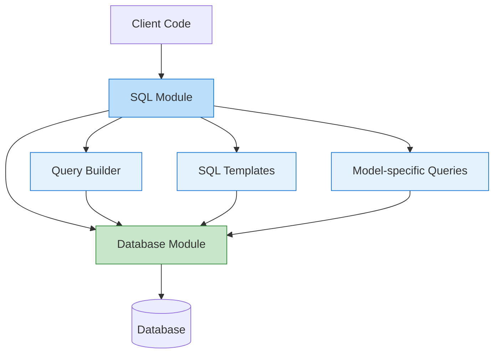
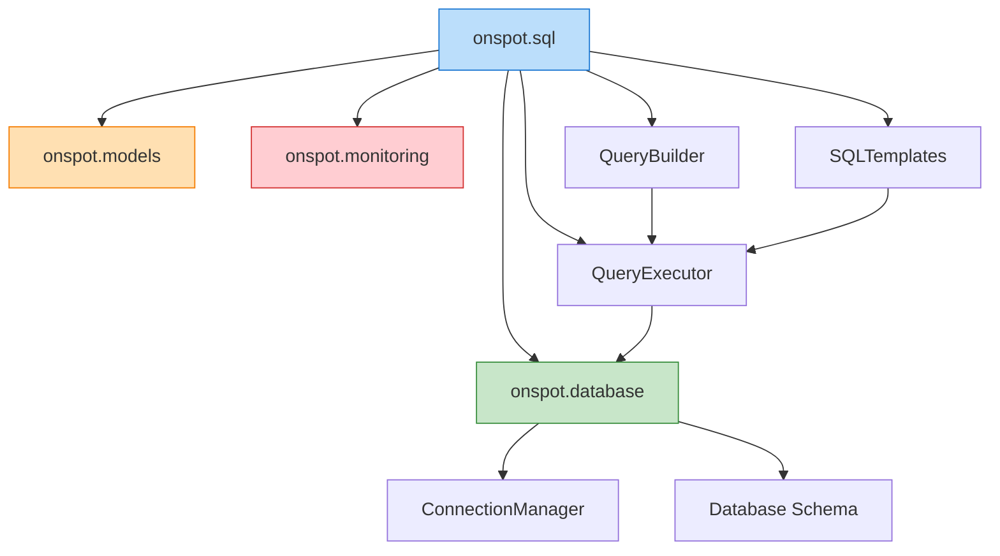

# SQL API

The `onspot.sql` module provides advanced SQL query building and execution capabilities for the OnSpot Predictive Model, enabling complex data analysis and reporting on parking data.

## Architecture

The SQL module architecture is designed to provide flexible, type-safe, and efficient database interactions for the OnSpot Predictive Model. It integrates with the database module to provide higher-level SQL capabilities.



### Component Relationships

The SQL module interacts with several other modules in the system:



## SQL Query Builder

### `SQLQueryBuilder`

```python
class SQLQueryBuilder:
    """
    Advanced SQL query builder for constructing complex SQL queries.
    
    This class provides a fluent interface for building SQL queries with
    type safety and parameter binding.
    
    Attributes:
        dialect: SQL dialect to use.
        paramstyle: SQL parameter style (qmark, named, format, etc.)
    """
    
    def __init__(
        self,
        dialect: str = "postgresql",
        paramstyle: str = "named"
    ):
        """
        Initialize the SQL query builder.
        
        Args:
            dialect: SQL dialect to use ("postgresql", "mysql", "sqlite").
            paramstyle: Style for parameter markers ("named", "qmark", "format").
            
        Example:
            >>> # Create SQL query builder for PostgreSQL
            >>> builder = SQLQueryBuilder(dialect="postgresql")
            >>> 
            >>> # Build a query with the fluent interface
            >>> query, params = (
            ...     builder
            ...     .select("location_id", "AVG(occupancy) AS avg_occupancy")
            ...     .from_("parking_data")
            ...     .where("timestamp >= :start_date")
            ...     .where("timestamp <= :end_date")
            ...     .group_by("location_id")
            ...     .having("AVG(occupancy) > 0.5")
            ...     .order_by("avg_occupancy DESC")
            ...     .build({"start_date": "2023-01-01", "end_date": "2023-12-31"})
            ... )
        """
```

#### Methods

##### `select`

```python
def select(self, *columns, distinct: bool = False) -> "SQLQueryBuilder":
    """
    Add a SELECT clause to the query.
    
    Args:
        *columns: Columns to select.
        distinct: Whether to add DISTINCT keyword.
        
    Returns:
        Self, for method chaining.
        
    Example:
        >>> builder = SQLQueryBuilder()
        >>> builder.select("location_id", "timestamp", "occupancy")
        >>> 
        >>> # With DISTINCT
        >>> builder.select("location_id", distinct=True)
    """
```

##### `from_`

```python
def from_(self, *tables, joins: List[Dict] = None) -> "SQLQueryBuilder":
    """
    Add a FROM clause to the query.
    
    Args:
        *tables: Tables to select from.
        joins: List of join specifications.
        
    Returns:
        Self, for method chaining.
        
    Example:
        >>> builder = SQLQueryBuilder()
        >>> builder.from_("parking_data")
        >>> 
        >>> # With joins
        >>> joins = [
        ...     {
        ...         "type": "LEFT JOIN",
        ...         "table": "locations",
        ...         "on": "parking_data.location_id = locations.id"
        ...     }
        ... ]
        >>> builder.from_("parking_data", joins=joins)
    """
```

##### `where`

```python
def where(self, condition: str, operator: str = "AND") -> "SQLQueryBuilder":
    """
    Add a WHERE condition to the query.
    
    Args:
        condition: WHERE condition.
        operator: Logical operator to combine with previous conditions ("AND", "OR").
        
    Returns:
        Self, for method chaining.
        
    Example:
        >>> builder = SQLQueryBuilder()
        >>> builder.where("location_id = :location_id")
        >>> builder.where("timestamp >= :start_date")
        >>> 
        >>> # With OR operator
        >>> builder.where("special_event = TRUE", operator="OR")
    """
```

##### `group_by`

```python
def group_by(self, *columns) -> "SQLQueryBuilder":
    """
    Add a GROUP BY clause to the query.
    
    Args:
        *columns: Columns to group by.
        
    Returns:
        Self, for method chaining.
        
    Example:
        >>> builder = SQLQueryBuilder()
        >>> builder.group_by("location_id", "DATE(timestamp)")
    """
```

##### `having`

```python
def having(self, condition: str, operator: str = "AND") -> "SQLQueryBuilder":
    """
    Add a HAVING clause to the query.
    
    Args:
        condition: HAVING condition.
        operator: Logical operator to combine with previous conditions.
        
    Returns:
        Self, for method chaining.
        
    Example:
        >>> builder = SQLQueryBuilder()
        >>> builder.having("COUNT(*) > 10")
        >>> builder.having("AVG(occupancy) > 0.7")
    """
```

##### `order_by`

```python
def order_by(self, *clauses) -> "SQLQueryBuilder":
    """
    Add an ORDER BY clause to the query.
    
    Args:
        *clauses: ORDER BY clauses.
        
    Returns:
        Self, for method chaining.
        
    Example:
        >>> builder = SQLQueryBuilder()
        >>> builder.order_by("timestamp DESC", "location_id ASC")
    """
```

##### `limit`

```python
def limit(self, limit: int) -> "SQLQueryBuilder":
    """
    Add a LIMIT clause to the query.
    
    Args:
        limit: Maximum number of rows to return.
        
    Returns:
        Self, for method chaining.
        
    Example:
        >>> builder = SQLQueryBuilder()
        >>> builder.limit(100)
    """
```

##### `offset`

```python
def offset(self, offset: int) -> "SQLQueryBuilder":
    """
    Add an OFFSET clause to the query.
    
    Args:
        offset: Number of rows to skip.
        
    Returns:
        Self, for method chaining.
        
    Example:
        >>> builder = SQLQueryBuilder()
        >>> builder.offset(200)
    """
```

##### `with_`

```python
def with_(self, name: str, query: str) -> "SQLQueryBuilder":
    """
    Add a WITH clause (Common Table Expression) to the query.
    
    Args:
        name: Name of the CTE.
        query: Query for the CTE.
        
    Returns:
        Self, for method chaining.
        
    Example:
        >>> builder = SQLQueryBuilder()
        >>> builder.with_(
        ...     "daily_occupancy",
        ...     "SELECT location_id, DATE(timestamp) as date, AVG(occupancy) as avg_occ " +
        ...     "FROM parking_data GROUP BY location_id, DATE(timestamp)"
        ... )
        >>> builder.select("location_id", "AVG(avg_occ) as monthly_avg")
        >>> builder.from_("daily_occupancy")
        >>> builder.group_by("location_id")
    """
```

##### `union`

```python
def union(self, other_builder: "SQLQueryBuilder", all: bool = False) -> "SQLQueryBuilder":
    """
    Add a UNION clause to combine with another query.
    
    Args:
        other_builder: Another SQLQueryBuilder instance to union with.
        all: Whether to use UNION ALL (True) or UNION (False).
        
    Returns:
        Self, for method chaining.
        
    Example:
        >>> # First query: High occupancy parkings
        >>> builder1 = SQLQueryBuilder()
        >>> builder1.select("location_id", "'high' AS category", "occupancy")
        >>> builder1.from_("parking_data")
        >>> builder1.where("occupancy > 0.8")
        >>> 
        >>> # Second query: Low occupancy parkings
        >>> builder2 = SQLQueryBuilder()
        >>> builder2.select("location_id", "'low' AS category", "occupancy")
        >>> builder2.from_("parking_data")
        >>> builder2.where("occupancy < 0.2")
        >>> 
        >>> # Combine with union
        >>> builder1.union(builder2)
        >>> builder1.order_by("location_id", "category")
    """
```

##### `build`

```python
def build(self, params: Dict = None) -> Tuple[str, Dict]:
    """
    Build the SQL query.
    
    Args:
        params: Parameters for the query.
        
    Returns:
        Tuple of (query, params).
        
    Example:
        >>> builder = SQLQueryBuilder()
        >>> builder.select("*").from_("parking_data").where("location_id = :location_id")
        >>> query, params = builder.build({"location_id": "P-123"})
        >>> print(query)
        >>> print(params)
    """
```

## SQL Templates

### `SQLTemplate`

```python
class SQLTemplate:
    """
    SQL template for frequently used queries.
    
    This class provides parameterized SQL templates for common queries used
    in the OnSpot Predictive Model.
    
    Attributes:
        dialect: SQL dialect to use.
        templates: Dictionary of named SQL templates.
    """
    
    def __init__(
        self,
        dialect: str = "postgresql",
        template_dir: str = None
    ):
        """
        Initialize the SQL template.
        
        Args:
            dialect: SQL dialect to use.
            template_dir: Directory containing SQL templates.
            
        Example:
            >>> # Create SQL template with default templates
            >>> template = SQLTemplate()
            >>> 
            >>> # Create SQL template with custom template directory
            >>> template = SQLTemplate(template_dir="sql/custom_templates")
        """
```

#### Methods

##### `get_template`

```python
def get_template(self, name: str) -> str:
    """
    Get a SQL template by name.
    
    Args:
        name: Name of the template.
        
    Returns:
        SQL template string.
        
    Example:
        >>> template = SQLTemplate()
        >>> daily_occupancy_query = template.get_template("daily_occupancy")
    """
```

##### `render_template`

```python
def render_template(self, name: str, params: Dict = None) -> Tuple[str, Dict]:
    """
    Render a SQL template with parameters.
    
    Args:
        name: Name of the template.
        params: Parameters for the template.
        
    Returns:
        Tuple of (rendered_query, params).
        
    Example:
        >>> template = SQLTemplate()
        >>> query, params = template.render_template(
        ...     "location_occupancy",
        ...     {"location_id": "P-123", "start_date": "2023-01-01", "end_date": "2023-01-31"}
        ... )
        >>> 
        >>> # Execute the query
        >>> from onspot.database import execute_query
        >>> results = execute_query(query, params)
    """
```

##### `add_template`

```python
def add_template(self, name: str, template: str) -> None:
    """
    Add a new SQL template.
    
    Args:
        name: Name for the template.
        template: SQL template string.
        
    Example:
        >>> template = SQLTemplate()
        >>> template.add_template(
        ...     "peak_hours",
        ...     """
        ...     SELECT EXTRACT(HOUR FROM timestamp) AS hour,
        ...            AVG(occupancy) AS avg_occupancy
        ...     FROM parking_data
        ...     WHERE location_id = :location_id
        ...       AND timestamp BETWEEN :start_date AND :end_date
        ...     GROUP BY EXTRACT(HOUR FROM timestamp)
        ...     ORDER BY avg_occupancy DESC
        ...     LIMIT 5
        ...     """
        ... )
    """
```

## Pre-defined Queries

### `get_occupancy_trend`

```python
def get_occupancy_trend(
    location_id: str = None,
    start_date: str = None,
    end_date: str = None,
    interval: str = "day",
    connection: Any = None,
    connection_string: str = None
) -> pd.DataFrame:
    """
    Get occupancy trend for a location over time.
    
    Args:
        location_id: ID of the location. If None, gets trend for all locations.
        start_date: Start date for the trend. If None, uses earliest available date.
        end_date: End date for the trend. If None, uses latest available date.
        interval: Time interval for aggregation. Options: "hour", "day", "week", "month".
        connection: Existing database connection.
        connection_string: Database connection string.
        
    Returns:
        DataFrame containing the occupancy trend.
        
    Example:
        >>> # Get daily occupancy trend for a specific location in January 2023
        >>> trend = get_occupancy_trend(
        ...     location_id="P-123",
        ...     start_date="2023-01-01",
        ...     end_date="2023-01-31",
        ...     interval="day"
        ... )
        >>> 
        >>> # Plot the trend
        >>> import matplotlib.pyplot as plt
        >>> plt.figure(figsize=(12, 6))
        >>> plt.plot(trend["time_interval"], trend["avg_occupancy"])
        >>> plt.title(f"Daily Occupancy Trend for Location {location_id}")
        >>> plt.xlabel("Date")
        >>> plt.ylabel("Average Occupancy")
        >>> plt.show()
    """
```

### `get_location_comparison`

```python
def get_location_comparison(
    location_ids: List[str],
    metric: str = "occupancy",
    start_date: str = None,
    end_date: str = None,
    connection: Any = None,
    connection_string: str = None
) -> pd.DataFrame:
    """
    Compare multiple parking locations based on a metric.
    
    Args:
        location_ids: List of location IDs to compare.
        metric: Metric to compare. Options: "occupancy", "turnover", "duration".
        start_date: Start date for comparison.
        end_date: End date for comparison.
        connection: Existing database connection.
        connection_string: Database connection string.
        
    Returns:
        DataFrame containing the comparison results.
        
    Example:
        >>> # Compare occupancy for multiple locations
        >>> locations = ["P-123", "P-456", "P-789"]
        >>> comparison = get_location_comparison(
        ...     location_ids=locations,
        ...     metric="occupancy",
        ...     start_date="2023-01-01",
        ...     end_date="2023-03-31"
        ... )
        >>> 
        >>> # Display results
        >>> print(comparison)
    """
```

### `get_prediction_accuracy`

```python
def get_prediction_accuracy(
    model_id: str = None,
    location_id: str = None,
    start_date: str = None,
    end_date: str = None,
    connection: Any = None,
    connection_string: str = None
) -> pd.DataFrame:
    """
    Get prediction accuracy for a model.
    
    Args:
        model_id: ID of the model. If None, gets accuracy for all models.
        location_id: ID of the location. If None, gets accuracy for all locations.
        start_date: Start date for the accuracy calculation.
        end_date: End date for the accuracy calculation.
        connection: Existing database connection.
        connection_string: Database connection string.
        
    Returns:
        DataFrame containing the prediction accuracy metrics.
        
    Example:
        >>> # Get prediction accuracy for a specific model and location
        >>> accuracy = get_prediction_accuracy(
        ...     model_id="parking_model_v2",
        ...     location_id="P-123",
        ...     start_date="2023-01-01",
        ...     end_date="2023-01-31"
        ... )
        >>> 
        >>> # Display accuracy metrics
        >>> print(f"RMSE: {accuracy['rmse'].mean():.4f}")
        >>> print(f"MAE: {accuracy['mae'].mean():.4f}")
        >>> print(f"R²: {accuracy['r2'].mean():.4f}")
    """
```

### `get_peak_hours`

```python
def get_peak_hours(
    location_id: str,
    day_type: str = "all",
    start_date: str = None,
    end_date: str = None,
    connection: Any = None,
    connection_string: str = None
) -> pd.DataFrame:
    """
    Get peak occupancy hours for a parking location.
    
    Args:
        location_id: ID of the location.
        day_type: Type of days to include. Options: "all", "weekday", "weekend", "holiday".
        start_date: Start date for the analysis.
        end_date: End date for the analysis.
        connection: Existing database connection.
        connection_string: Database connection string.
        
    Returns:
        DataFrame containing the peak hours and their average occupancy.
        
    Example:
        >>> # Get peak hours for weekdays
        >>> peaks = get_peak_hours(
        ...     location_id="P-123",
        ...     day_type="weekday",
        ...     start_date="2023-01-01",
        ...     end_date="2023-03-31"
        ... )
        >>> 
        >>> # Display peak hours
        >>> for _, row in peaks.iterrows():
        ...     print(f"Hour: {row['hour']}, Avg Occupancy: {row['avg_occupancy']:.2f}")
    """
```

### `get_monthly_report`

```python
def get_monthly_report(
    location_ids: List[str] = None,
    year: int = None,
    month: int = None,
    connection: Any = None,
    connection_string: str = None
) -> Dict:
    """
    Generate a monthly report for parking occupancy.
    
    Args:
        location_ids: List of location IDs to include. If None, includes all locations.
        year: Year for the report. If None, uses the current year.
        month: Month for the report. If None, uses the current month.
        connection: Existing database connection.
        connection_string: Database connection string.
        
    Returns:
        Dictionary containing the monthly report data.
        
    Example:
        >>> # Generate report for January 2023
        >>> report = get_monthly_report(
        ...     year=2023,
        ...     month=1
        ... )
        >>> 
        >>> # Access report sections
        >>> summary = report["summary"]
        >>> daily_trends = report["daily_trends"]
        >>> peak_hours = report["peak_hours"]
        >>> location_stats = report["location_stats"]
        >>> 
        >>> print(f"Average occupancy: {summary['avg_occupancy']:.2f}")
        >>> print(f"Peak day: {summary['peak_day']}")
    """
```

## Data Analysis Utilities

### `generate_occupancy_heatmap`

```python
def generate_occupancy_heatmap(
    location_id: str,
    start_date: str = None,
    end_date: str = None,
    day_type: str = "all",
    connection: Any = None,
    connection_string: str = None
) -> pd.DataFrame:
    """
    Generate data for a heatmap of occupancy by hour and day.
    
    Args:
        location_id: ID of the location.
        start_date: Start date for the heatmap.
        end_date: End date for the heatmap.
        day_type: Type of days to include. Options: "all", "weekday", "weekend".
        connection: Existing database connection.
        connection_string: Database connection string.
        
    Returns:
        DataFrame with occupancy data for each hour and day.
        
    Example:
        >>> # Generate heatmap data for weekdays
        >>> heatmap_data = generate_occupancy_heatmap(
        ...     location_id="P-123",
        ...     start_date="2023-01-01",
        ...     end_date="2023-01-31",
        ...     day_type="weekday"
        ... )
        >>> 
        >>> # Plot heatmap
        >>> import seaborn as sns
        >>> import matplotlib.pyplot as plt
        >>> 
        >>> # Pivot the data to get a 2D matrix
        >>> pivot_data = heatmap_data.pivot(
        ...     index="day_of_week",
        ...     columns="hour",
        ...     values="avg_occupancy"
        ... )
        >>> 
        >>> # Create heatmap
        >>> plt.figure(figsize=(14, 8))
        >>> sns.heatmap(
        ...     pivot_data,
        ...     cmap="YlOrRd",
        ...     annot=True,
        ...     fmt=".2f",
        ...     linewidths=0.5
        ... )
        >>> plt.title(f"Weekly Occupancy Patterns for Location {location_id}")
        >>> plt.xlabel("Hour of Day")
        >>> plt.ylabel("Day of Week")
        >>> plt.show()
    """
```

### `calculate_turnover_rate`

```python
def calculate_turnover_rate(
    location_id: str,
    start_date: str = None,
    end_date: str = None,
    interval: str = "day",
    connection: Any = None,
    connection_string: str = None
) -> pd.DataFrame:
    """
    Calculate parking turnover rate for a location.
    
    Args:
        location_id: ID of the location.
        start_date: Start date for the calculation.
        end_date: End date for the calculation.
        interval: Time interval for aggregation. Options: "hour", "day", "week", "month".
        connection: Existing database connection.
        connection_string: Database connection string.
        
    Returns:
        DataFrame containing the turnover rate data.
        
    Example:
        >>> # Calculate daily turnover rate
        >>> turnover = calculate_turnover_rate(
        ...     location_id="P-123",
        ...     start_date="2023-01-01",
        ...     end_date="2023-01-31",
        ...     interval="day"
        ... )
        >>> 
        >>> # Plot turnover rate
        >>> import matplotlib.pyplot as plt
        >>> plt.figure(figsize=(12, 6))
        >>> plt.plot(turnover["interval"], turnover["turnover_rate"])
        >>> plt.title(f"Daily Turnover Rate for Location {location_id}")
        >>> plt.xlabel("Date")
        >>> plt.ylabel("Turnover Rate")
        >>> plt.grid(True)
        >>> plt.show()
    """
```

## Advanced Queries

### `create_data_cube`

```python
def create_data_cube(
    dimensions: List[str],
    measures: List[str],
    filters: Dict = None,
    connection: Any = None,
    connection_string: str = None
) -> pd.DataFrame:
    """
    Create a data cube for multidimensional analysis of parking data.
    
    Args:
        dimensions: List of dimensions for the cube (e.g., location, time, weather).
        measures: List of measures to aggregate (e.g., occupancy, duration).
        filters: Dictionary of filters to apply.
        connection: Existing database connection.
        connection_string: Database connection string.
        
    Returns:
        DataFrame containing the data cube.
        
    Example:
        >>> # Create a data cube with location and time dimensions
        >>> cube = create_data_cube(
        ...     dimensions=["location_id", "day_of_week", "hour_of_day"],
        ...     measures=["avg_occupancy", "max_occupancy", "utilization"],
        ...     filters={"start_date": "2023-01-01", "end_date": "2023-03-31"}
        ... )
        >>> 
        >>> # Analyze the cube
        >>> # Get average occupancy by day of week
        >>> day_analysis = cube.groupby("day_of_week")["avg_occupancy"].mean()
        >>> print(day_analysis)
        >>> 
        >>> # Get peak hours across all locations
        >>> hour_analysis = cube.groupby("hour_of_day")["avg_occupancy"].mean()
        >>> peak_hour = hour_analysis.idxmax()
        >>> print(f"Peak hour across all locations: {peak_hour}")
    """
```

### `perform_anomaly_detection`

```python
def perform_anomaly_detection(
    location_id: str = None,
    start_date: str = None,
    end_date: str = None,
    method: str = "zscore",
    threshold: float = 2.0,
    connection: Any = None,
    connection_string: str = None
) -> pd.DataFrame:
    """
    Detect anomalies in parking occupancy data.
    
    Args:
        location_id: ID of the location. If None, detects anomalies for all locations.
        start_date: Start date for anomaly detection.
        end_date: End date for anomaly detection.
        method: Method for anomaly detection. Options: "zscore", "iqr", "isolation_forest".
        threshold: Threshold for anomaly detection.
        connection: Existing database connection.
        connection_string: Database connection string.
        
    Returns:
        DataFrame containing the detected anomalies.
        
    Example:
        >>> # Detect anomalies using Z-score method
        >>> anomalies = perform_anomaly_detection(
        ...     location_id="P-123",
        ...     start_date="2023-01-01",
        ...     end_date="2023-12-31",
        ...     method="zscore",
        ...     threshold=3.0
        ... )
        >>> 
        >>> # Print anomalies
        >>> print(f"Detected {len(anomalies)} anomalies")
        >>> for _, row in anomalies.iterrows():
        ...     print(f"Date: {row['timestamp']}, Occupancy: {row['occupancy']:.2f}, Z-score: {row['score']:.2f}")
    """
```

## SQL Export and Import

### `export_query_to_csv`

```python
def export_query_to_csv(
    query: str,
    output_path: str,
    params: Dict = None,
    connection: Any = None,
    connection_string: str = None
) -> str:
    """
    Export query results to a CSV file.
    
    Args:
        query: SQL query to execute.
        output_path: Path to save the CSV file.
        params: Parameters for the query.
        connection: Existing database connection.
        connection_string: Database connection string.
        
    Returns:
        Path to the saved CSV file.
        
    Example:
        >>> # Define a query to export
        >>> query = """
        ...     SELECT location_id, DATE(timestamp) as date, AVG(occupancy) as avg_occupancy
        ...     FROM parking_data
        ...     WHERE timestamp BETWEEN :start_date AND :end_date
        ...     GROUP BY location_id, DATE(timestamp)
        ...     ORDER BY location_id, date
        ... """
        >>> 
        >>> # Export to CSV
        >>> csv_path = export_query_to_csv(
        ...     query,
        ...     "reports/occupancy_by_date.csv",
        ...     params={"start_date": "2023-01-01", "end_date": "2023-01-31"}
        ... )
        >>> 
        >>> print(f"Data exported to {csv_path}")
    """
```

### `load_sql_script`

```python
def load_sql_script(
    script_path: str,
    params: Dict = None,
    connection: Any = None,
    connection_string: str = None,
    execute: bool = True,
    return_results: bool = False
) -> Any:
    """
    Load and optionally execute a SQL script from a file.
    
    Args:
        script_path: Path to the SQL script file.
        params: Parameters to substitute in the script.
        connection: Existing database connection.
        connection_string: Database connection string.
        execute: Whether to execute the script.
        return_results: Whether to return the query results.
        
    Returns:
        If return_results is True, returns the query results.
        If execute is True but return_results is False, returns the number of affected rows.
        If execute is False, returns the processed script.
        
    Example:
        >>> # Execute a SQL script
        >>> result = load_sql_script(
        ...     "sql/create_summary_tables.sql",
        ...     params={"start_date": "2023-01-01", "end_date": "2023-12-31"},
        ...     execute=True
        ... )
        >>> 
        >>> # Load a script without executing
        >>> script = load_sql_script(
        ...     "sql/create_summary_tables.sql",
        ...     execute=False
        ... )
        >>> print(script)
    """
``` 