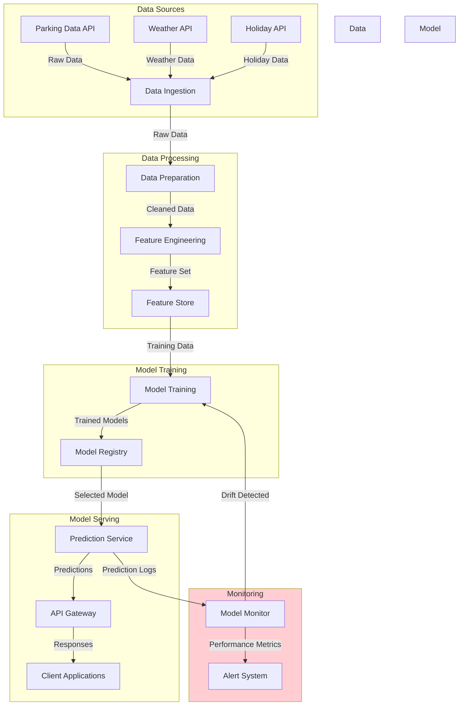
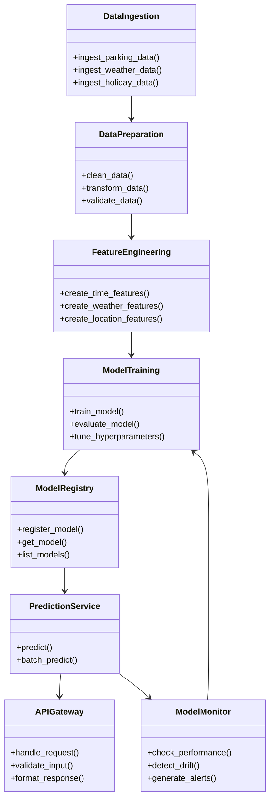
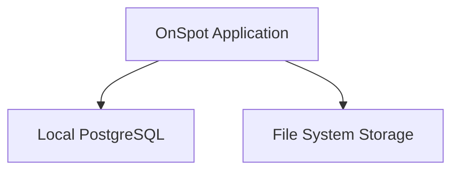
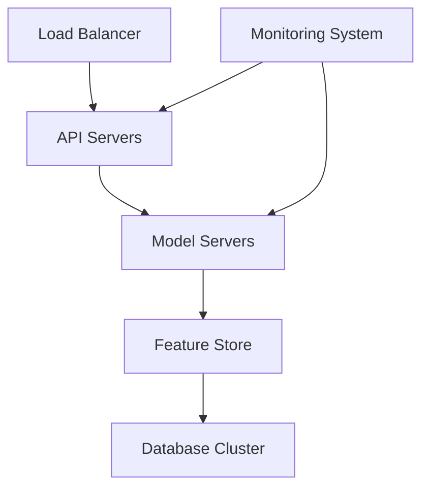

# Architecture Overview

This document provides a high-level overview of the OnSpot Predictive Model system architecture.

## System Architecture

The OnSpot Predictive Model system is designed as a modular, extensible architecture that separates concerns and allows for independent development and deployment of components.

## Core Components

### Data Processing

- **Data Ingestion**: Collects data from various sources including parking sensors, weather APIs, and event calendars.
- **Data Preparation**: Cleans, transforms, and validates the incoming data.
- **Feature Engineering**: Generates features for the machine learning models.
- **Feature Store**: Centralized repository for storing, managing, and serving features.

### Model Training

- **Model Training**: Trains machine learning models on the processed data.
- **Cross-Validation**: Evaluates model performance using time series cross-validation.
- **Hyperparameter Tuning**: Optimizes model hyperparameters.
- **Model Registry**: Stores and versions trained models.

### Model Serving

- **Prediction Service**: Serves predictions from trained models.
- **API Gateway**: Provides a RESTful API for client applications.
- **Client Applications**: Web or mobile applications that consume the predictions.

### Monitoring

- **Model Monitor**: Tracks model performance and data drift.
- **Alert System**: Notifies when model performance degrades.
- **Retraining Scheduler**: Schedules model retraining based on time or performance.

## Data Flow

1. **Data Collection**: Raw parking data, weather data, and holiday information are collected from various sources.
2. **Data Processing**: Raw data is cleaned, transformed, and enriched with features.
3. **Model Training**: Features are used to train machine learning models.
4. **Model Serving**: Trained models are deployed to the prediction service.
5. **Prediction**: The prediction service generates occupancy predictions based on input features.
6. **Monitoring**: Model performance is continuously monitored and alerts are generated if issues are detected.
7. **Retraining**: Models are retrained periodically or when performance degrades.

## Component Diagram

## Technology Stack

- **Programming Language**: Python 3.8+
- **Data Processing**: Pandas, NumPy
- **Machine Learning**: Scikit-learn, XGBoost, LightGBM
- **API**: Flask, FastAPI
- **Database**: PostgreSQL, Supabase
- **Monitoring**: Prometheus, Grafana
- **Deployment**: Docker, Kubernetes (optional)

## Deployment Architecture

The system can be deployed in various configurations, from a simple local deployment to a fully distributed cloud deployment.

### Simple Deployment

For development or small-scale use:

### Production Deployment

For production use with high availability:

## Next Steps

- See [System Design](system_design.md) for more detailed information on the system design.
- See [Components](components.md) for detailed descriptions of each component.
- See [Data Flow](data_flow.md) for more information on data flow.
- See [Deployment](deployment.md) for deployment instructions. 